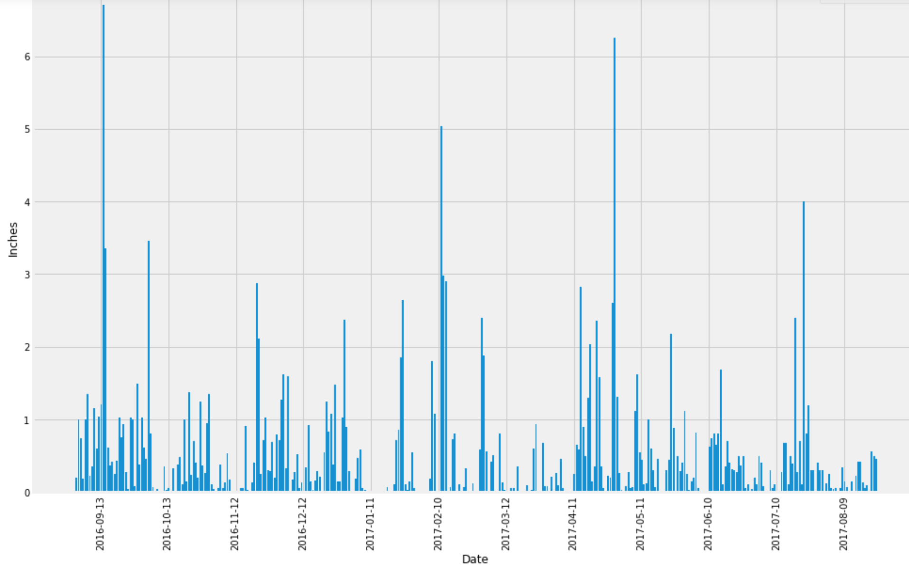
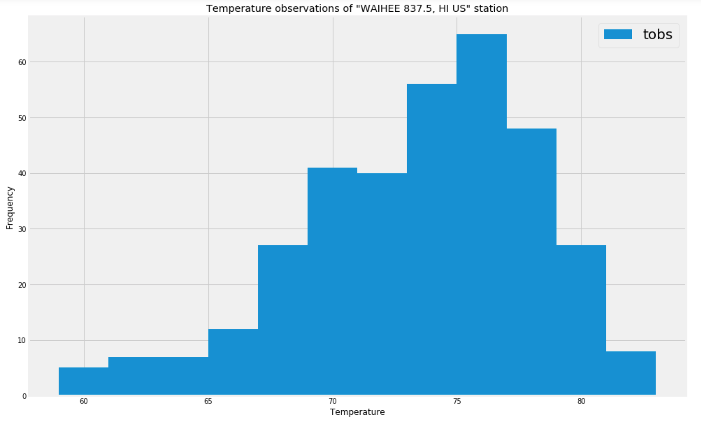

# SQLAlchemy-Challenge

        

## Introduction

This project is made to be able to give future references to people who plan to travel to Honolulu Hawaii or for people who want information about the weather in the place. It is composed of two parts that are:
- An analysis of the climate in the area
- A REST API from which you can make inquiries about the information

### Tools

The following tools were used to do the analysis and the REST API

#### Analysis:
- Python (Pandas, matplotlib, sqlalchemy)
- Jupyter Notebook
- SQL

#### REST API:
- Python (flask, datetime, pymongo, os)
- NoSQL
- MongoDB

The platform used to mount the REST API is Heroku

## Data

The information used is from the years 2016, 2017 and 2018 and is in a SQLite database and in .json format files, these can be found in the "Resources" folder, this was provided by Tecnológico de Monterrey.
With this the analysis was performed as well as the REST API
SQLite Database

#### Measurement Table

|  Column  | Data Type |
| -------- | ----------|
|    id    | `Integer` |
|  station |   `Text`  |
|   date   |   `Text`  |
|   prcp   |  `Float`  |
|   tobs   |  `Float`  |

- id      -> Registry Identification Number
- station -> Station Code
- date    -> Record Date
- prcp    -> Precipitation Measurement
- tobs    -> Temperature Measurement

#### Station Table

|    Column    | Data Type |
| ------------ | ----------|
|    id        | `Integer` |
|  station     |   `Text`  |
|   name       |   `Text`  |
|   latitude   |  `Float`  |
|   longitude  |  `Float`  |
|   elevation  |  `Float`  |

- id        -> Station Identification Number
- station   -> station code
- name      -> station name
- latitude  -> station latitude
- longitude -> station longitude
- elevation -> station elevation

## Analysis

For this analysis, the information from the SQL database that was explained previously was used. This can be found in the file called 'climate_starter.ipynb'.
The analysis was centralized in several stages:

   

- In this graph you can see the behavior of rainfall over time, in 2016 September was the most active month and in 2017 the most active months were February, April and October. This analysis can be made more specific to find the relationship between months and years.

+ It was determined that:
    + The station "WAIHEE 837.5, HI US" has the highest number of observations
    + The lowest temperature recorded for the station "WAIHEE 837.5, HI US" is: 54.0
    + The highest temperature recorded for the station "WAIHEE 837.5, HI US" is: 85.0
    + The average temperature for the station "WAIHEE 837.5, HI US" is: 71.66

   

- An analysis of the WAIHEE station was made in which the temperature and frequency are related, here it can be observed that the frequency accumulates between the 75 and 80 range of the temperature

## REST API

-------------------------------
This project consist in making an API that contains data about climate Honolulu, Hawaii

Here you can see the API with more details:
- [Surfers Hawaii API](https://enr1qu319-api-hawaii-climate.herokuapp.com "API")

